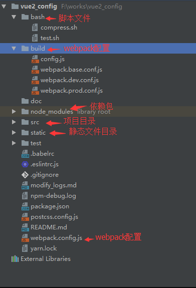
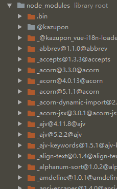
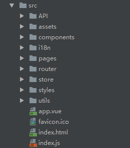

# 三章 项目介绍和运行

## 项目结构

通过几张截图直观了解

展示依赖

前端项目文件都在src目录下

## 安装

cd 项目根目录`npm install` 安装依赖

## 运行

`npm run dev`    项目开发环境的运行命令

`npm run build` 项目打包命令

`npm run relesse` 项目部署命令，结合一些脚本使用，一键部署到服务器。涉及很多服务器配置，不详解，本地开发只需上面两个命令即可。

