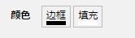
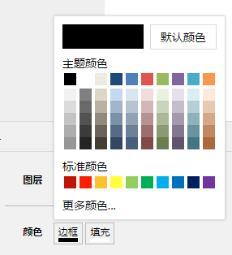
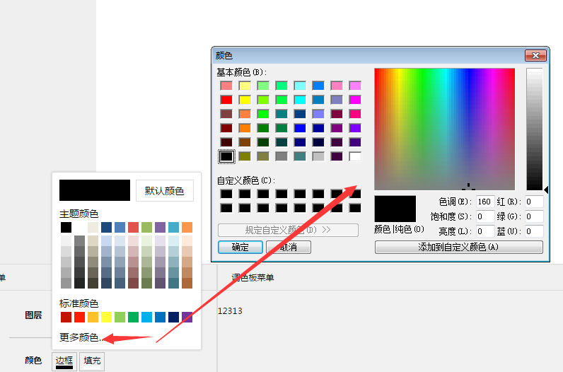

# 颜色选择器组件

## 效果展示

### 效果一

**1**



**２**



**３**



### 使用说明

<font color=#ffbb00>说明：组件基于vue-color-picker，修改．感谢作者</font> [可查看这里](http://vue-color-picker.rxshc.com/)

这是一段使用事例：
```vue
<colorPicker
      name="边框"
      v-model="strokeColor"
      :defaultColor="strokeColorDefault"
      v-on:change="handleChangeStrokeColor">
</colorPicker>
```

属性介绍：

名称|说明
---|---
name| props传入 选色框标题
v-model| data 绑定的颜色值
defaultColor| 默认颜色
v-on:change| 颜色选择的处理函数

更多颜色是html5的input type='color'