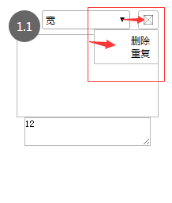

# 下拉菜单组件

## drawdown_menu.vue 组件效果展示

**效果一**




**效果二**


## 介绍

具体实现请查看　dropdown_menu.vue文件

两个命名slot

slot名 | 说明
---|---
dropdownLink | 下拉菜单标题
menuList | 下拉菜单列表


## 使用

### 引入组件
```javascript
   import dropdown from '../../../components/dropdown/dropdown_menu.vue'
```

### 组件注册
```javascript
    components: {
       dropdown,
    }
```

### 组件中使用
```vue
<dropdown class="set-title">
      
      <div slot="menuList">
             <ul>
                    <li @click="delTitleList(tIndex)">删除序列</li>
             </ul>
      </div>
</dropdown>
```
