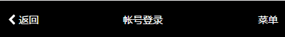

# 页头组件

### 效果展示




------------------------
### 使用介绍

注意：　本文使用ES6, 关于webpack２在下ES6[点击这里]()
1. 单文件引入
import headerM from '*/header_m.vue'
2. 组件注册
```
computed: {
    headerM
}
```
3. 使用
```
 <header-m title="标题">
    <div>内容</div>
    <div slot="left">左</div>
    <div slot="right">右</div>
 </header-m>
```

为了便于扩展，组件内容通过slot分发，对slot不了解的同学可看[文档](https://cn.vuejs.org/v2/guide/components.html#使用插槽分发内容)


---
### 代码讲解

```
<template>
    <div class="header-m" :style="styles">
        <div class="left">
            <slot name="left">
                <router-link :to="to" slot="left" style="color: #fff;display: flex;align-items: center;justify-content: flex-start">
                    <icon name="chevron-left" scale="1" style="color: #fff"></icon>&nbsp;<span>返回</span>
                </router-link>
            </slot>
        </div>
        <div class="title">
            <slot>
                {{title}}
            </slot>
        </div>
        <div class="right">
            <slot name="right"></slot>
        </div>

    </div>
</template>
<script>

    export default {

        props: {
            title: {
                type: String,
                default: ''
            },
            styles: {
                type: Object,
                default() {
                    return {
                        color: '#fff',
                        background: '#000'
                    }
                }
            },
            to: {
                type: String,
                default: '/'
            }
        }
    }
</script>
<style lang="scss" rel="stylesheet/scss" scoped>
    @import "../../styles/fun";
    .header-m {
        padding: px2rem(18px) px2rem(10px);
        display: flex;
        align-items: center;
        box-sizing: border-box;
        font-size: 14px;
        height: px2rem(50px);
        line-height: 1;
        position: relative;
        text-align: center;
        white-space: nowrap;
        .left {
            text-align: left;
            flex: 0.5;
        }
        .title {
            overflow: hidden;
            text-overflow: ellipsis;
            white-space: nowrap;
            font-size: inherit;
            font-weight: 400;
            flex: 1;
        }
        .right {
            text-align: right;
            flex: 0.5;
        }
        a {
            text-decoration: none;
        }
    }
</style>
```