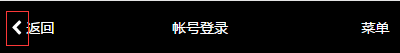

# icon 组件

### 效果展示



### 使用介绍

效果中红框中的图标，是vue-awesome图标．

该组件是通过全局注册，局部组件方式后期运用后实现．

1. 在vue主文件中引入
```
/**
 * Created by allen on 17-4-26.
 */
import Vue from 'vue'
import router from './router'
import App from './app.vue'
import store from './store'

import '*/awesome' // 引入icon组件全局注册


new Vue({
    el: '#app',
    store,
    router,
    i18n,
    // components: { App }
    render: h => h(App)
})
```

2. 使用
```
<icon name="chevron-left" scale="1" style="color: #fff"></icon>&nbsp;<span>返回</span>
```

`name`是图标名称，这个名称可在[awesome官网查找](http://fontawesome.dashgame.com/)


### 代码讲解

```
import Vue from 'vue'

/* Pick one way between the 2 following ways */

// only import the icons you use to reduce bundle size
import 'vue-awesome/icons/flag'

// or import all icons if you don't care about bundle size
import 'vue-awesome/icons'

/* Register component with one of 2 methods */

import Icon from 'vue-awesome/components/Icon'

// globally (in your main .js file)
Vue.component('icon', Icon)

// or locally (in your component file)
/*
export default {
    components: {
        Icon
    }
}*/

```