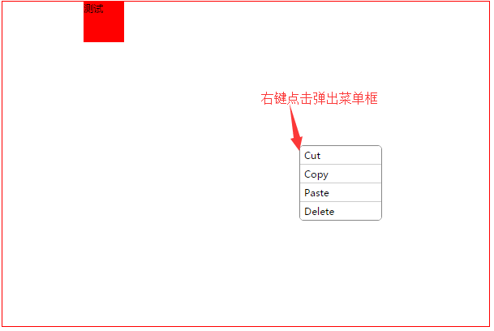

# 右键菜单

## 效果展示



## 使用

右键区域自适应父元素宽高,区域内容直接放在组件`<right-click-menu>`内

左键点击组件区域菜单关闭

1. props:

menuList 菜单列表数组

2. Event:
    * 子菜单点击返回两个数据：
        - 子菜单内容，@content
        - 菜单索引 @index

例子：
```html
<div style="width: 600px;height: 400px;border: 1px solid red">
      <right-click-menu @content="getContent" @index="getIndex" :menuList="menu">
            <div style="width: 50px;height: 50px;background-color: red;margin-left: 100px;">测试</div>
      </right-click-menu>
</div>

methods: {
     getContent(c) {
          console.log(c) // 子菜单内容
     },
     getIndex(i) {
          console.log(i) // 子菜单索引，0开始

          switch (i) { // 子菜单点击处理
               case 0:
                ...
          }
     }
},

```