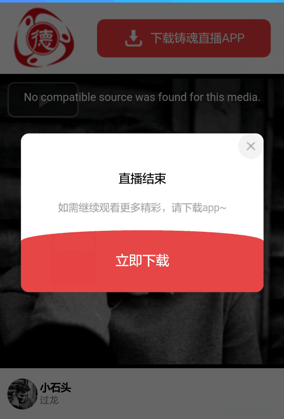
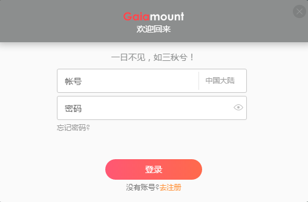

# 弹框

### 效果展示
##### 效果１

##### 效果２


-----------------
### 使用介绍
组件功能，依赖等说明：
    阴影弹框组件
    1.vue2
    2.px2rem sass函数依赖，用于手机端rem（不需要直接删除，改成px）
    [px2rem在这里有介绍](../chapter4/cssFun.html)
使用：
    一. Attributes
        show {Boolean} 默认false,  显示组件

        title {String} 标题，（为空时slot分发）

        icon {}

        lineStyle {Object} 标题下方的线styled对象 title使用slot分发是无线，默认有线（可选惨，lineH线高, color颜色），不要线调用组件时 :lineStyle="{lineH: '0px'}"

        width {String} 展示框的宽度

    二.Events
        closeToast 关闭弹框事件 父组件 必须v-on监听，不用$on （详见vue官网，自定义事件）

    三.slot
        1. title
        2. icon  说明：再无title分发时有效
        3. container和未命名slot。

    四. 组件中存在问题
        1.事件传递时向父组件传递参数。父组件监听事件时，本身处理函数也需要传参数，如：将for循环中的数据作为参数传递，这种情况下组件传递到父组件的参数不能获取

##### 效果事例代码
```
<toast
                :show="dialogShow"
                title=""
                :lineStyle="{lineH: '0'}"
                :toastShowStyle="{width: '85%', borderRadius: '10px'}"
                @closeToast="closeToast">
                
                <div class="con">
                    <h1>直播结束</h1>
                    <p>如需继续观看更多精彩，请下载app~</p>
                    <div class="toast-download">
                        <div class="p-1"></div>
                        <div class="p-2" @click="downloadApp">
                            立即下载
                        </div>
                    </div>
                </div>
            </toast>
```

-----------------
### 代码讲解

