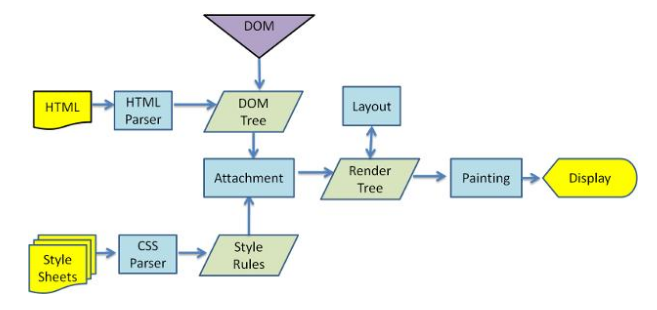

# 重排重绘

## DOM树和渲染树

浏览器下载完页面中的所有组件——HTML标记、JavaScript、CSS、图片之后会解析生成两个内部数据结构——DOM树和渲染树。

1. 解析HTML(HTML Parser)
2. 构建DOM树(DOM Tree)
3. 渲染树构建(Render Tree)
4. 绘制渲染树(Painting)

## 重排

当DOM的变化影响了元素的几何属性（宽或高,字体大小，位置，display:none），浏览器需要重新计算元素的几何属性，同样其他元素的几何属性和位置也会因此受到影响。浏览器会使渲染树中受到影响的部分失效，并重新构造渲染树。这个过程称为重排

## 重绘
当元素改变的时候，将不会影响元素在页面当中的位置,
完成重排后，浏览器会重新绘制受影响的部分到屏幕，该过程称为重绘。

>文档第一次构建必然完成一次重排和重绘

## 常见触发重排

1. 增加、删除、修改(改变DOM几何属性) DOM
1. 元素位置改变
1. 元素尺寸改变
1. 元素内容改变
1. 页面渲染初始化
1. 浏览器窗口尺寸改变
1. font-size
1. 计算offsetWidth和offsetHeight

|常见的重排元素|常见的重排元素|常见的重排元素|常见的重排元素|
|---|---|---|---|
|width	|height	|padding	|margin|
|display	|border-width	|border	|top
|position	|font-size	|float	|text-align
|overflow-y	|font-weight	|overflow	|left
font-family	|line-height	|vertical-align	|right
clear	|white-space	|bottom	|min-height

常见的重绘元素	|常见的重绘元素|常见的重绘元素|常见的重绘元素
---|---|---|---
color	|border-style	|visibility	|background
text-decoration	|background-image	|background-position	|background-repeat
outline-color	|outline	|outline-style	|border-radius
outline-width	|box-shadow	|background-size|

注：display:none 会触发 reflow，而 visibility:hidden 只会触发 repaint，

## 优化
>减少重排能够节省浏览器对其子元素及父类元素的重新渲染；避免过分的重绘也能节省浏览器性能

1. 将多次改变样式属性的操作合并成一次操作
1. 将需要多次重排的元素，position属性设为absolute或fixed，
这样此元素就脱离了文档流，它的变化不会影响到其他元素。例如有动画效果的元素就最好设置为绝对定位。
1. 由于display属性为none的元素不在渲染树中，对隐藏的元素操作不会引发其他元素的重排。(如果要对一个元素进行复杂的操作时，可以先隐藏它，操作完成后再显示。这样只在隐藏和显示时触发2次重排。)
1. 不要使用 table 布局，可能很小的一个小改动会造成整个 table 的重新布局

>1. 尽可能限制reflow的影响范围，尽可能在低层级的DOM节点上，上述例子中，如果你要改变p的样式，class就不要加在div上，通过父元素去影响子元素不好。
2. 避免设置大量的style属性，因为通过设置style属性改变结点样式的话，每一次设置
3. 触发一次reflow，所以最好是使用class属性
 实现元素的动画，它的position属性，最好是设为absoulte或fixed，这样不会影响其他元素的布局
4. 动画实现的速度的选择。比如实现一个动画，以1个像素为单位移动这样最平滑，但是reflow就会过于频繁，大量消耗CPU资源，如果以3个像素为单位移动则会好很多。
5. 不要使用table布局，因为table中某个元素旦触发了reflow，那么整个table的元素都会触发reflow。那么在不得已使用table的场合，可以设置table-layout:auto;或者是table-layout:fixed这样可以让table一行一行的渲染，这种做法也是为了限制reflow的影响范围
6. 如果CSS里面有计算表达式，每次都会重新计算一遍，出发一次reflow