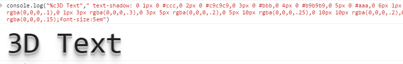

# js 丰富你的console


发现aiqiyi的这个日志很有意思吧

```js
console.log("%c%s",
            "color: red; font-size: 24px;",
            "日志内容");
```
> log 的第一个参数声明第二、第三个参数的作用，第二个参数就是样式，第三个参数是要输出的字符串

```js
console.log("%c3D Text"," text-shadow: 0 1px 0 #ccc,0 2px 0 #c9c9c9,0 3px 0 #bbb,0 4px 0 #b9b9b9,0 5px 0 #aaa,0 6px 1px rgba(0,0,0,.1),0 0 5px rgba(0,0,0,.1),0 1px 3px rgba(0,0,0,.3),0 3px 5px rgba(0,0,0,.2),0 5px 10px rgba(0,0,0,.25),0 10px 10px rgba(0,0,0,.2),0 20px 20px rgba(0,0,0,.15);font-size:5em")
```



## console.log API

格式说明符| 描述
--------|---------
%s      | 将该值格式化为一个字符串。
%d和%i  | 将该值格式化为整数。
%f      | 将该值格式化为浮点值。
%o      | 将该值格式化为可展开的DOM元素（如在“元素”面板中）。
%O      | 将该值设置为可展开的JavaScript对象。
%c      | 根据您提供的CSS样式格式化输出字符串。

[更多文档](https://developers.google.com/chrome-developer-tools/docs/console-api)

## 封装控制台