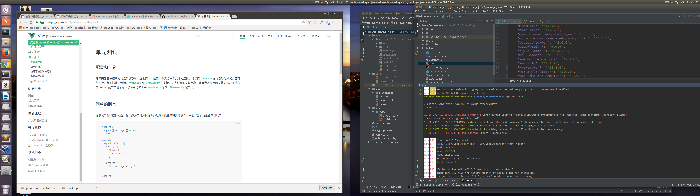

# 前端测试

## 测试

### unit 单元测试

* karma 测试运行框架(运行在浏览器)
* mocha 测试框架 \[其他测试框架jasmine 自带断言库]
* [chai](http://www.jianshu.com/p/f200a75a15d2) 断言库（expect风格，接近自然预言） \[其他should.js]

### e2e 端到端测试

* nightwatch

> 个人理解unit和e2e就是所谓的白盒测试和黑盒测试，

### 测试覆盖率
>单元测试非常重要，同时最好具有较高的测试覆盖率。再次强调测试覆盖率是一种发现未被测试覆盖的代码的手段，它不是一个考核质量的目标。
测试覆盖率报告包含下面四个：
* Statements: 语句覆盖率，执行到每个语句；
* Branches: 分支覆盖率，执行到每个 if 代码块；
* Functions: 函数覆盖率，调用到程式中的每一个函数；
* Lines: 行覆盖率, 执行到程序中的每一行。

[Code coverage](https://en.wikipedia.org/wiki/Code_coverage)

[代码测试覆盖率分析](https://www.v2ex.com/t/385149)

### 测试环境

* 浏览器下测试
* node环境下的测试

### 前端灰度发布

灰度无疑是你产品迭代中的一个保障

一般是后端先发布，前端后发布。

正式环境A,灰度环境B,(可通过query参数区分，如a.com?g=1);用户请求到达cdn， 再到nginx，选择部分用户302跳转到B的url,静态资源也应该有两个回源地址。分别是https://static.a.tv 的正式环境地址以及 https://static1.a.tv 的灰度地址，而B环境的静态资源需要加载灰度的静态资源回源地址（这部分可以在编译过程中根据自己需要处理）

[这里有一片好文](http://www.jianshu.com/p/88f206f48278)

[互联网产品灰度发布](http://blog.csdn.net/boonya/article/details/51537674)

### 回滚


## vue 测试

1. vue
[官方介绍](https://cn.vuejs.org/v2/guide/unit-testing.html)
2. vuex
[官方介绍](https://vuex.vuejs.org/zh-cn/testing.html)

## vue 测试遇到的错误

* karma 运行错误




解决方案：

[这里有个评论中找到的答案](http://www.jianshu.com/p/a515fbbdd1b2)

> phantomjs 需要自己安装在电脑

[安装方法](http://blog.csdn.net/sinat_21302587/article/details/53580491?locationNum=3&fps=1)

* nightwatch 运行出错


解决方案：
[这里有个评论中找到的答案](https://stackoverflow.com/questions/40432460/error-retrieving-a-new-session-from-the-selenium-server#)

* Error: [vuex] vuex requires a Promise polyfill in this browser.

 vuex中使用axios,axios就是基于promise. ie下不支持promise

 解决方案：

 ```
 npm install --save-dev bable-polyfill
 ```

 `"babel-polyfill": "^6.26.0",`

 修改webpack配置
 ```
 entry: { // 入口
             // index: path.join(__dirname + '/../src/index.js')
             index: ["babel-polyfill", path.join(__dirname + '/../src/index.js')] // 解决IE不兼容【IE报vuex requires a Promise polyfill in this browser问题解决】
         },
 ```

>当我使用vue-cli init我的项目时，我遇到了同样的问题。在我更新到Java 9之后，这个问题解决了。

[jdk的安装](http://blog.csdn.net/oh_mourinho/article/details/52691398)

* 运行 测试命令 npm run unit 报错Error: [vuex] vuex requires a Promise polyfill in this browser.

解决方案：
>因为测试时启动的浏览器不是我们常用的chrome，而是PhantomJs。为了能让其像chrome一样正常运转，需要在kara.confi.js中设置其在启动我们程序的入口文件前，先启动polyfill.js

修改Karma.conf.js:
```
 files: ['../../node_modules/babel-polyfill/dist/polyfill.js', './index.js'],
```