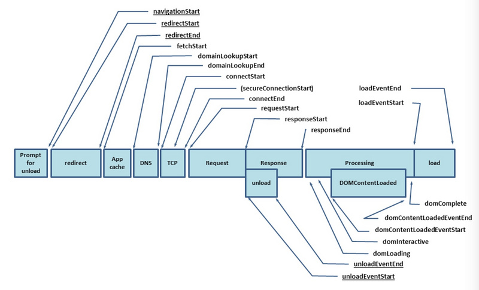

# url请求过程-get,post

## url请求过程
网上找了一张图：

* 浏览器向DNS服务器查找输入URL对应的IP地址。
* DNS服务器返回网站的IP地址。
* 浏览器根据IP地址与目标web服务器在80端口上建立TCP连接
* 浏览器获取请求页面的html代码。
* 浏览器在显示窗口内渲染HTML。
* 窗口关闭时，浏览器终止与服务器的连接。

## get,post

## http和https
HTTP：是互联网上应用最为广泛的一种网络协议，是一个客户端和服务器端请求和应答的标准（TCP），用于从WWW服务器传输超文本到本地浏览器的传输协议，它可以使浏览器更加高效，使网络传输减少。

HTTPS：是以安全为目标的HTTP通道，简单讲是HTTP的安全版，即HTTP下加入SSL层，HTTPS的安全基础是SSL，因此加密的详细内容就需要SSL。

HTTPS协议的主要作用可以分为两种：一种是建立一个信息安全通道，来保证数据传输的安全；另一种就是确认网站的真实性。

（先了解一些概念，之后再详细了解）
[这里](https://www.cnblogs.com/wqhwe/p/5407468.html)