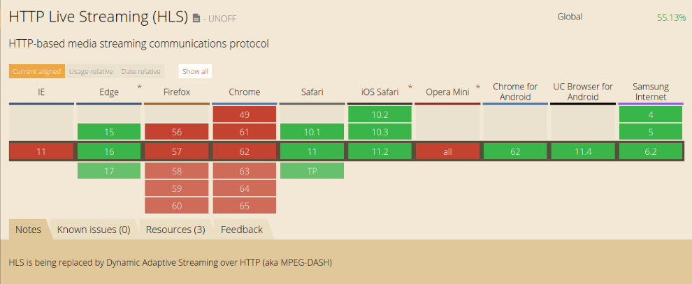

# video播放

## H5 video

```html
<video src="movie.ogg" controls="controls">
您的浏览器不支持 video 标签。
</video>
```

### 属性
属性名       |值         |描述
------------|-----------|----------
autoplay	|autoplay	|如果出现该属性，则视频在就绪后马上播放。
controls	|controls	|如果出现该属性，则向用户显示控件，比如播放按钮。
height	    |pixels	    |设置视频播放器的高度。
loop	    |loop	    |如果出现该属性，则当媒介文件完成播放后再次开始播放。
muted	    |muted	    |规定视频的音频输出应该被静音。
poster	    |URL	    |规定视频下载时显示的图像，或者在用户点击播放按钮前显示的图像。
preload	    |preload	|如果出现该属性，则视频在页面加载时进行加载，并预备播放.如果使用 "autoplay"，则忽略该属性。
src	        |url	    |要播放的视频的 URL。
width	    |pixels	    |设置视频播放器的宽度。


### 事件

本想自己归纳,发现w3上已经很细了[all事件](http://www.w3school.com.cn/tags/html_ref_eventattributes.asp)

```html
       <video id='player' src="../../../assets/video/1.mp4" controls="controls"
             @play="videoPlay('play')"
             @pause="videoPlay('pause')"
             @playing="videoPlay('playing')"
             @abort="videoPlay('abort')"
             @canplay="videoPlay('canplay')"

      ></video>
```

### 自定义控制条

```js
let myplayer = document.getElementById('player')
// 对象方法
myplayer.play() // 播放
myplayer.pause() // 暂停
myplayer.load() // 重新加载视频元素。
myplayer.addTextTrack() // 向视频添加新的文本轨道。
myplayer.canPlayType() // 检查浏览器是否能够播放指定的视频类型。

对象属性
myplayer.currentTime // 当前播放时间,设置获取,单位s
myplayer.videoHeight
myplayer.videoWidth

// 监听
myplayer.ontimeupdate = function(){} // 当前播放位置改变则执行函数
```

[canPlayType方法这里很详细](http://www.w3school.com.cn/tags/av_met_canplaytype.asp)

#### 对象属性,方法

[链接](https://www.cnblogs.com/wwlhome/p/5855866.html)


### 全屏(目前发现是最大的瓶颈)

>video里面没有提供全屏的API,自定义控制栏最大的问题就在这里,只有自己实现

`window.innerWidth` 浏览器窗口的高度和宽度。

1. requestFullScreen
```js
    // 全屏
    vFullScreen () {
        let element = document.querySelector('#playBox')
        this.videoDom.width = window.screen.availWidth
        if (element.requestFullscreen) {
          element.requestFullscreen()
        } else if (element.mozRequestFullScreen) {
          element.mozRequestFullScreen()
        } else if (element.webkitRequestFullscreen) {
          element.webkitRequestFullscreen()
        } else if (element.msRequestFullscreen) {
          element.msRequestFullscreen()
        }
      },

    // 退出全屏
    vExitFullScreen () {
        this.videoDom.width = 600
        if (document.exitFullscreen) {
          document.exitFullscreen()
        } else if (document.mozExitFullScreen) {
          document.mozExitFullScreen()
        } else if (document.webkitExitFullscreen) {
          document.webkitExitFullscreen()
        }
      },
```
>这个方法最大的弊端是全屏后不能在显示控制菜单

2. position fixed
这个方案目前是最好的方案

>注意这个两种全屏在效果上差别很大,requestFullscreen,是将整个浏览器铺满整个显示器屏幕,使元素全屏;而fixid是相对浏览器window

>用的vue2实现的,上面两种方法实现全屏
```html
<!--播放器-->
          <div id="playBox" :class="{'full-screen': isFullScreen}" style="border: 1px solid red">
            <video :id="vId"
                   @canplay="vCanplay"
                   @play="handlePlay"
                   @pause="handlepause"
                   @click="vExitFullScreen">
              <source src="../../../assets/video/1.mp4">
              您的浏览器版本太低,请及时更新
            </video>
            <div v-if="barShow" class="control-bar">
              <button @click="vPlay">播放</button>
              <button @click="vPause">暂停</button>
              <!--<button @click="vBig">全屏</button>
              <button @click="vSmall">退出全屏</button>-->
              <button @click="vLoad">重载</button>
              <button @click="speed(0.5)">慢放</button>
              <button @click="speed(1)">速度x1</button>
              <button @click="speed(2)">速度x2</button>
              <button @click="speed(3)">速度x3</button>
              <button @click="vFullScreen">全屏2</button>
              <button @click="vExitFullScreen">退出全屏2</button>
              <span>进度条:</span>
              <progress :value="currentTime" :max="duration" id="pro"></progress>
              <span>音量:</span>
              <input type="range" min="0" max="100" v-model="volumeValue" @change="setVolume" id="ran"/>
              <button @click="vFullScreen3">全屏3</button>
              <button @click="vExitFullScreen3">退出全屏3</button>
            </div>
```


```js
    data () {
      return {
        vId: 'player',
        videoDom: '',
        barShow: false,
        volumeValue: 50,
        duration: 0,
        currentTime: 0,
        timer: '',
        isFullScreen: false,
      }
    },
     methods: {
          vCanplay () { // 监听视频可播放
            this.videoDom = document.getElementById(this.vId)
            this.barShow = true
            console.log(this.videoDom.canPlayType('video/mp4; codecs="avc1.4D401E, mp4a.40.2"'))
            this.duration = this.videoDom.duration
          },
          handlePlay () {
            this.intervalTime()
          },
          handlepause () {
            clearInterval(this.timer)
          },
          vPlay () { // 播放
            this.videoDom.play()
          },
          vPause () { // 暂停
            this.videoDom.pause()
          },
          vSmall () {
            this.videoDom.height = this.videoDom.videoHeight
          },
          vBig () { // 设置小屏中屏大屏的方法,注意用的videoHeight
            alert(this.videoDom.currentTime)
            alert(this.videoDom.videoHeight)
            this.videoDom.height = this.videoDom.videoHeight * 2
          },
          vLoad () { // 重新加载
            this.videoDom.load()
          },
          speed (n) { // 播放速度
            this.videoDom.playbackRate = n
          },
          vExitFullScreen () { // requestFullscreen实现全屏退出
            if (document.exitFullscreen) {
              document.exitFullscreen()
            } else if (document.mozExitFullScreen) {
              document.mozExitFullScreen()
            } else if (document.webkitExitFullscreen) {
              document.webkitExitFullscreen()
            }
          },
          vFullScreen () { // requestFullscreen实现全屏
            let element = this.videoDom
            if (element.requestFullscreen) {
              element.requestFullscreen()
            } else if (element.mozRequestFullScreen) {
              element.mozRequestFullScreen()
            } else if (element.webkitRequestFullscreen) {
              element.webkitRequestFullscreen()
            } else if (element.msRequestFullscreen) {
              element.msRequestFullscreen()
            }
          },
          vExitFullScreen3 () { // fixed 实现全屏退出
            this.isFullScreen = false
          },
          vFullScreen3 () { // fixed 实现全屏
            this.isFullScreen = true
          },
          getStyle (el, name) {
            if (window.getComputedStyle) {
              return window.getComputedStyle(el, null)[name]
            } else {
              return el.currentStyle[name]
            }
          },
          setVolume () { // 音量
            this.videoDom.volume = this.volumeValue / 100
          },
          intervalTime () { // 周期获取当前播放时间
            this.timer = setInterval(() => {
              this.currentTime = this.videoDom.currentTime
            }, 100)
          }
     }
```
>
```scss
   #playBox {
    video {
      width: 600px;
    }
  }
  .full-screen { // 全屏添加class
    position: fixed;
    top: 0;
    left: 0;
    bottom: 0;
    right: 0;
    z-index: 99999;
    background-color: #000;
    video {
      width: 100% !important;
      height: 100% !important;
      border: 1px solid
    }
    .control-bar {
      position: absolute;
      bottom: 0;
    }
  }
  .control-bar {
    background-color: #fff;
    width: 100%;
  }
```
## 视频加密Blob

本想给个输入框,输入视频地址播放,发现发现很多直播,视频都是blog:http加密过得
[先看下别人的理解](https://www.xttblog.com/?p=1587)


## h5播放m3u8
>HLS，Http Live Streaming 是由Apple公司定义的用于实时流传输的协议，HLS基于HTTP协议实现，传输内容主要包括两部分，一是M3U8描述文件，二是TS媒体文件。我们可以理解其就是一种视频格式，这里对于其原理不做过多分析，如需了解，请查阅HLS相关资料。.m3u8格式视频需要两个条件：

1. 支持H5的video标签；
2. 在条件1的基础上同时需要支持.m3u8类型的视频播放。

由于HLS这种协议是由Apple公司定义的，所以苹果手机能够很好的支持.m3u8视频的播放；android手机浏览器只要支持H5的video标签就基本上支持.m3u8这种类型的视频播放；而PC端浏览器即使支持H5的video标签，也不支持.m3u8视频的播放。浏览器的兼容性:



>我看pc解决m3u8还是通过flash解决
,// TODO 之后有空在写这部分

## video.js
[video.js官网](http://videojs.com/)

video.js给出了m3u8的解决方案[文档](http://docs.videojs.com/tutorial-troubleshooting.html)

使用[videojs-contrib-hls](https://github.com/videojs/videojs-contrib-hls)

[官方例子](http://jsbin.com/vokipos/8/edit?html,output)

[官方测试m3u8列子](http://videojs.github.io/videojs-contrib-hls/)

// TODO 学习video-contrib-hls是如何实现