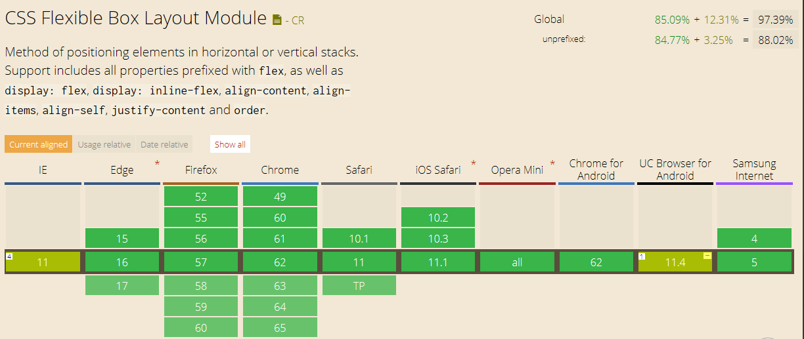

# 地铁管理系统

## 兼容性

### 了解到现在市面上４中浏览器内核

* trident(IE内核)

* Webkit(google内核)
    1. Safari
    1. Chrome

* Gecko
    1. FireFox

* presto
    1. Opera7及以上版本;

在国内主要还是考虑IE内核和google内核，国内主流浏览器360,QQ,搜狗，百度，UC,等大多基于这两种内核，所以主要还是测IE和google浏览器兼容性

### 解析vue不支持IE8

vue在ie8下运行的报错：

可以看到不支持ES5的defineProperty，前面有讲这个是vue在数据劫持使用的方法。

### flex兼容性

下面是flex在个浏览器兼容性的截图：

显示ie兼容到11，不过我测试时发现10也是兼容的，9以及一下不兼容

## 图表

调研过的几个不错库：

1. [d3.js](https://d3js.org/)

>D3是最流行的可视化库之一，它可以将任意数据绑定到DOM（Document Object Model，文档对象模型），然后对该文件提供数据驱动转换。还可以将一组数据生成基本的HTML表，或生成一个SVG条形图。 正好我桌子上有一本关于d3.js的书《D3.js数据可视化实战手册》

2. [Echart](http://echarts.baidu.com/feature.html)

>ECharts 基于 Canvas 的纯 Javascript 实现的图表库，提供直观，生动，可交互，可个性化定制的数据可视化图表。创新的拖拽重计算、数据视图、值域漫游等特性大大增强了用户体验，赋予了用户对数据进行挖掘、整合的能力。