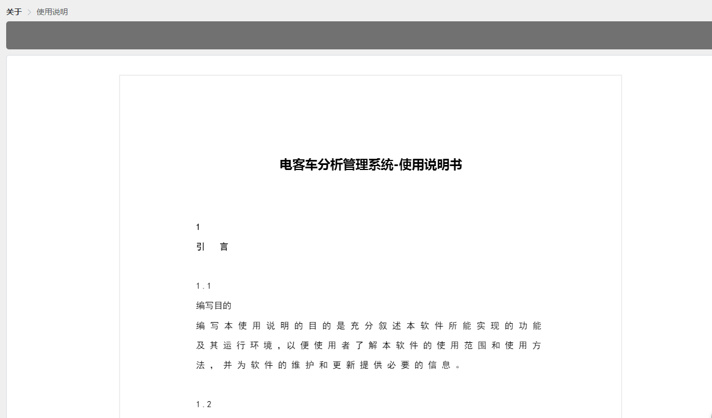

# 地铁管理系统

经过几个月的努力项目终于做完了,一把鼻涕一把心酸泪.这一类的项目都能想得到的,各种ie的兼容性,奇怪的需求之类的.

## IE下遇到的问题

### 了解到现在市面上４中浏览器内核

* trident(IE内核)

* Webkit(google内核)
    1. Safari
    1. Chrome

* Gecko
    1. FireFox

* presto
    1. Opera7及以上版本;

在国内主要还是考虑IE内核和google内核，国内主流浏览器360,QQ,搜狗，百度，UC,等大多基于这两种内核，所以主要还是测IE和google浏览器兼容性

   对于IE的兼容性处理,项目使用的方法是优雅递减,先保证在高级浏览器上的展示效果,再考虑低端浏览,或是在这些浏览器上简化功能保证页面正常.
   用到的方法:
1. 使用js判断浏览器版本信息
```
function checkBrower () {
        var Sys = {}
        var ua = navigator.userAgent.toLowerCase()
        if (window.ActiveXObject) { // 针对IE
          Sys.ie = ua.match(/msie ([\d.]+)/)[1]
        } else if (ua.indexOf('firefox') > -1) {
          Sys.firefox = ua.match(/firefox\/([\d.]+)/)[1]
        } else if (ua.indexOf('chrome') > -1) {
          Sys.chrome = ua.match(/chrome\/([\d.]+)/)[1]
        } else if (window.opera) {
          Sys.opera = ua.match(/opera.([\d.]+)/)[1]
        } else if (window.openDatabase) {
          Sys.safari = ua.match(/version\/([\d.]+)/)[1]
        }
        return Sys
      }
```
对于ie高版本,在上面IE判断情况下利用ActiveXObject判断
```
        if (!!window.ActiveXObject || ('ActiveXObject' in window)) {
          Sys.ie = true
        }
```
      再利用 `:class={}` 绑定各种兼容性样式

2. HTML条件注释IE,在vue组件中并不好用,只能在index.html中使用

3. IE下居然不能直接使用IP访问,我的图片,视频地址都是ip.(IE有个什么增强功能)

### position:fixed

你那里查fixed都是相对窗口的,(社会社会,社会这本书你读了吗)在IE下就不是居然是相对父级有position定位的,再试在做播放器全屏时用到,所有浏览器下都表现良好,IE不行.这里用了其他兼容方法,h5的`requestFullscreen`方法,这个方法是铺面整个屏幕不是很好.当然也是向下兼容的,支持的情况下使用的是fiexd.

### download

这个属性感觉很用用啊,为什么IE不实现!!!
项目的图表使用canvas绘制,有个需求是打印图表.
```
let canvas = document.getElementById('canvas-el') // 画布
let a = document.createElement('a')
a.href = canvas.toDataURL('image/png')
a.download = '文件名'
a.click()
```
上面的就可以实现打印,很方便,在IE下就麻烦了,一就将前端canvas绘制的图表交个后端生成图片下载,二就是前端优雅降级,提示并简化功能
`'download' in document.createElement('a')` 判断download支持,如果支持就用上面的方法下载,否则open()方法跳出一个窗口,加载图片,右键保存,方法如下:
```
let myW = window.open('', '', 'width=800,height=600')
          myW.document.write('<p style="font-size: 12px;magin-bottom: 10px;">该浏览器不支持直接下载,请右键另存为或更换H5兼容性良好的浏览器!</p>')
```

### 解析vue不支持IE8

vue在ie8下运行的报错：


可以看到不支持ES5的defineProperty，前面有讲这个是vue在数据劫持使用的方法。

### flex兼容性

下面是flex在个浏览器兼容性的截图：


显示ie兼容到11，不过我测试时发现10也是兼容的，9以及一下不兼容


## 图表

调研过的几个不错库：

1. [d3.js](https://d3js.org/)

>D3是最流行的可视化库之一，它可以将任意数据绑定到DOM（Document Object Model，文档对象模型），然后对该文件提供数据驱动转换。还可以将一组数据生成基本的HTML表，或生成一个SVG条形图。 正好我桌子上有一本关于d3.js的书《D3.js数据可视化实战手册》

2. [Echart](http://echarts.baidu.com/feature.html)

>ECharts 基于 Canvas 的纯 Javascript 实现的图表库，提供直观，生动，可交互，可个性化定制的数据可视化图表。创新的拖拽重计算、数据视图、值域漫游等特性大大增强了用户体验，赋予了用户对数据进行挖掘、整合的能力。

3. canvas实现

在看需求时,觉得上面两个插件,足可以实现原型图上的需求.万万没想到,后面可以一直加需求.(1.需要把各种不同属性,单位的数据绘在一个图中,就像身高体重年龄要在一个折线图中展示;2.折线幅度可以鼠标控制3.一个坐标X上的Y轴数据对应多个,要在同一个X点上绘制,4.X轴点的距离要随某些数据来响应)每个需求都上你放弃现有的图表插件.

思路:
1. canvas 绘制图表曲线,和事件
2. 交互使用html,比如:经过某个点展示数据

## 视频播放

这一块感觉比较多,单独总结[在这里](../chapter6/video.html)

## window server部署

[这里](../chapter6/nginx.html)

## 需要接口返回的状态展示页面

项目使用的是vuex,所有的接口都是在action中,比如:需要在上一个接口成功返回后做下面的操作,或请求下一个接口.这就需要在action外告诉vue组件.目前使用的方法是使用一个state专门存一个接口对应的返回状态,在组件中去监听.
但这个方法会有弊端,如果需要同时关联到多个接口返回的状态时,逻辑就会变得复杂.

## pfd文档展示
1. 第一种最简单的方法就是使用一个链接跳转一个新窗口,利用浏览器展示pdf.

2. 后来就得太楼了,页面太白不美观,就在但前页面展示.效果:


发现有个pfd.js很好用的东西,兼容性还可以,至少IE11下可以正常.这个插件非常消耗性能.对于不能支持的浏览器,就是用方法1.

对于spa项目来说都希望模块化,直接`import ''`webpack提示文件大,打包不了.

使用npm install pdfjs 引入发现报错,fs 什么的.
网上说是加入
```js
node: {
    fs: 'empty'
  },
```
忽略警告,但还是不行;浏览器中报错一个方法未定义.网上也没找到答案

最后直接在index.html的head中引入,暴露全局对象.行的通.

目前也只能想到这种方法解决.感觉到这种方法不太好.容易有太多全局变量导致冲突.但向遇到只能全局引入的还没想到更好的方法.就比如:三方登录这些需要引入jkd有什么好方法.

## 视频截图中的问题

`Uncaught SecurityError: Failed to execute 'toDataURL' on 'HTMLCanvasElement': Tainted canvases may not be exported.`

是由于视频文件所在的域和图片和页面所在域不同，出现跨域传输的问题。

解决方案：

1. 将视频文件放到页面所在域下。
2. 利用nginx方向代理跨域