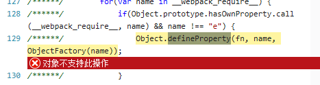

# 地铁管理系统

## 了解到现在市面上４中浏览器内核

* trident(IE内核)

* Webkit(google内核)
    1. Safari
    1. Chrome

* Gecko
    1. FireFox

* presto
    1. Opera7及以上版本;

在国内主要还是考虑IE内核和google内核，国内主流浏览器360,QQ,搜狗，百度，UC,等大多基于这两种内核，所以主要还是测IE和google浏览器兼容性

## 解析vue不支持IE8

vue在ie8下运行的报错：

可以看到不支持ES5的defineProperty，前面有讲这个是vue在数据劫持使用的方法。

## flex兼容性

下面是flex在个浏览器兼容性的截图：

显示ie兼容到11，不过我测试时发现10也是兼容的，9以及一下不兼容

