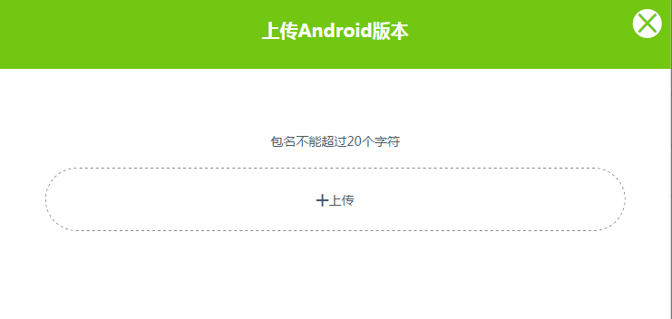
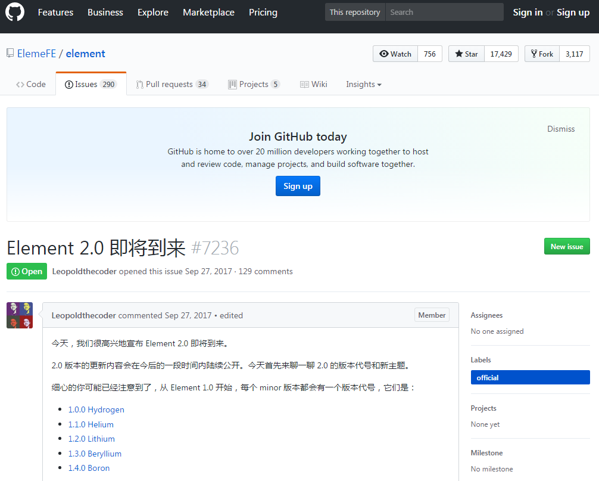

# 直播管理后台项目

## 先来介绍项目

<font color=#808000>来看一张大图,直观了解</font>


项目刚做完一个多月，乘着还有印象做些项目笔记.<font color=#800000>数据都是测试数据</font>

项目是一个直播管理后台，图片中的导航条很容易可以看到项目设计的功能，用户和主播管理，直播管理，收支管理（涉及支付体系）等


### 项目技术栈

1. webpack2
1. vue2
1. vuex2
1. vue-touter2
1. axios
1. sass
1. elementUI

这个后台项目的webpack配置，直接使用我提取的webpack通用配置，在这里[clone](https://github.com/caoshengxiang/vue2_config).所以技术栈不会有太大变化
顺便一说本文档也是在该项目的gh-pages分支．关于github的gh-pages分支看[这里](../chapter6.gh-pages.html)

这里有一个好东西`axios`，他封装了`fetch`．关于fetch替代ajax的文章也不少[传统 Ajax 已死，Fetch 永生](https://segmentfault.com/a/1190000003810652)
在项目中我的确用它替代了ajax,使用简单，很好用．回调使用`then`和`catch` 加上ES6 的箭头函数接近完美．

但是，在使用axios时也遇到的写问题无法解决

### 1. aixos不支持同步请求

这里的一个需求就是在拿到请求结果后才能做下一步

### 2. axios 没有onprogress

有这样一个需求需要前端来做．管理员上传Android安装包，一般有２０M以上，受网络原因上传时间会很长．需要在上传过程中展示上传的进度．

之前没有使用过axos，到处baidu google发现axios没有这个东西，还好听同事说ajax,可以实现．以下是我的实现代码：

```js
/*eslint-disable*/
        var xhr=new XMLHttpRequest();
        xhr.open('post',versionUploadApi + param.appPlatform,true);
        xhr.onreadystatechange=function (){
            if(this.readyState==4 && this.status == 200){
                commit('mut_get_version_list', true)
                commit('mut_upload_file_success', true)
            }
        }
        xhr.setRequestHeader('authToken', sessionStorage.authToken);
        xhr.upload.onprogress=function (ev){
            if(ev.lengthComputable){
                var precent=100 * ev.loaded/ev.total;
                console.log(Math.floor(precent));
                commit('mut_progress_rate', Math.floor(precent))
            }
        }

        xhr.send(param.formData);
        commit('mut_xhr', xhr)

/*eslint-enable*/
```
这段代码是不能通过我的ESLint校验的,所以代码快禁用ESLint

可以看到ajax XMLHttpRequest对象有一个`upload.onprogress`方法他的回调就返回了event对象，包含上传的信息．关于更多使用看[这里](http://www.cnblogs.com/tianyuchen/p/5594641.html).代码中的`var precent=100 * ev.loaded/ev.total;` 已经上传／总共文件大小

**看下效果：**




### element UI
elementUI组件是element团队开发的VUE组件库．我在其他公司前端好友了解这个UI库用的还是比较多．[官方文档](http://element.eleme.io/#/zh-CN)
我大概有两个项目中用了这个UI库，组件还是比较丰富，使用简单．特别是后台项目．如果设计再是基于elementUI的那就完美．
但是一般情况下不会这么完美．需要对样式重新设置．坑还是有的这也是为什么我要自己写一些共有的组件．

1. 之前的做法是对class样式重定义，但是很多样式优先级不够改不了
2. 近一步　样式加`!import`方式．发现还有部分样式不能覆盖．比较疑惑`!import`优先级不是最高吗？，这种做法还有个弊端，如果在同一个组件中用相同样式，比如说：调用的两个element组件都有`.el-input`，而我两个组件要不同样式．要么就出问题了．
可能会有个问题，直接增加一个样式来修改样式就好了．在这里很多情况是不得行的．标签的样式多在组件内部，你不可能把class加到对应标签上．等等问题
3. 在近一步，　发现直接在组件上添加style效果最好．
4. 在之后的项目继续去发现更好的方式．目前没有百度到好的方式，官方有提及但是效果不好．可能打开方式不对．继续探索．

```html
    <el-dialog :visible.sync="overageDialogFormVisible" :show-close="false" style="width: 600px;left: 35%">
        ...
    </el-dialog>
```

<font color=#800080>突然发现官网更新了，　＠2.0版本快要出来，期待更加实用</font>,快来凑热闹




想了解更多点[这里](https://github.com/ElemeFE/element/issues/7236)

官网在[这里](http://element.eleme.io/#/zh-CN)

----
### vue的一些收获收获

#### 1. 在一个请求完成之后做下一个请求
场景举例：点击删除一列数据，删除成功后刷新列表

之前对`this.$dispatch().then(()=>{this.$dispatch})` 有点误区，dispatch是一个异步函数.之前有个<font color=#FF0000>错误</font>的理解,dispatch提交一个异步action后．回调函数then,将在返回数据之后调用．和jquery的回调一样．事实上不是．第一个dispatch请求之后，数据还没有返回，then里面的diapatch就会执行．
我的解决方法是：添加一个state数据记录第一个请求的返回结果;在组件中watch监听这个状态为正确状态时调用第二个dispatch; 最后记得把状态直改回初始状态．方便下次完成上面的响应．
#### 2. 使用vuex时模板循环state数据是报错

这也算个小问题，但是还是困扰不我一段时间．问题就出在state数据初始．我初始数据时随便写了个字符串．他不是数组在循环报错．<font color=#FF0000>特别注意一点</font>在使用ES5的数组方法时非数组会报错，可以这样写进行避免：
```js
    let falseArr = ''
    let arr = falseArr || []
    arr.forEach((item)=>{})
```

#### 图片上传


点击上传按钮弹出文件选择．上传按钮定制，前端进行预览，点击保存按钮提交到服务器
```html
<div>
      
      <div class="upload">
             <el-button class="bt" icon="upload2">重新上传</el-button>
             <input type="file" id="file" class="file" name="file" @change="handleFile">
       </div>
</div>
```

```scss
    .upload {
            display: inline-block;
            position: relative;
            bottom: 36px;
            width: 110px;
            margin-left: 10px;
            .bt {
                position: absolute;
            }
            .file {
                opacity: 0;
                position: absolute;
                width: 110px;
                height: 36px;
            }
        }
```
要实现图片上传还得用input file，怎么对按钮定制呢，把他父元素设置为相对定位，input透明对设为0;通过absolute覆盖在自定义样式上就可．

```js
handleFile() { // 前端预览图片
     let f = document.getElementById('file').files[0]; // 这里file数组，我这里只传一张图片，就取第一个
     let img = document.getElementById('headImg');　// img标签
     let r= new FileReader();　
     let that = this;　// 回调中this的指向问题

     r.readAsDataURL(f);
     r.onload = function () { // this.result　就是图片base64
        img.src = this.result;
        that.detail.icon = this.result
     }
}
```
前端要预览得用base64展示．FileReader()，readAsDataURL()，获取base64.
将base64图片传到服务器

这里存在自己的服务器，更多会存在三方服务器上如：七牛.还没用过下次用的时候多学习．

#### vuex v-model表单问题
这个问题也困扰了我很久，vuex不能在commit之外修改state.有这样的需求，用户要编辑某个数据．在input框中展示并修改．会想到用v-model绑定数据．数据又是从state中来的．在vuex严格模式下会报错．之前的方式就是直接关掉严格默认．其实是自己不仔细了，官网对这个问题是有说明的[看这里](https://vuex.vuejs.org/zh-cn/forms.html)
直接修改state会导致vuex工具无法监听，然后想了个方法，利用placeholder
```html
 <input type="text" :placeholder="placeholder" v-model="data">
```
**正确打开方式**

方案一：给 <input> 中绑定 value，然后侦听 input 或者 change 事件，在事件回调中调用 action

```javascript
<input :value="message" @input="updateMessage">
// ...
computed: {
  ...mapState({
    message: state => state.obj.message
  })
},
methods: {
  updateMessage (e) {
    this.$store.commit('updateMessage', e.target.value)
  }
}
```

方案二：双向绑定的计算属性
必须承认，这样做比简单地使用“v-model + 局部状态”要啰嗦得多，并且也损失了一些 v-model 中很有用的特性。另一个方法是使用带有 setter 的双向绑定计算属性：
```js
<input v-model="message">
// ...
computed: {
  message: {
    get () {
      return this.$store.state.obj.message
    },
    set (value) {
      this.$store.commit('updateMessage', value)
    }
  }
}
```

这两种方式都是官方给的．我偏爱第二种方式．简单高大上．但是有个问题，如果我的state是个数组展示的是数组中的列表,好像这个方法我就没想到解决方案了．
还得用第一种方案．在v-for中将index作为参数传入，mutation中修该index对应的数据

```js
message = {　// message数据结构
    index: 1,
    data: '修改'
}
// 这里注意的是：commit和dispatch都只能传递一个参数．如果有很多数据，就把他放在一个对象上传递

mutations: {
  updateMessage (state, message) {
    state.obj[message.index] = message.data
  }
}
```


#### 国际化
国际化用的vue-i18n，这个项目没有使用但是，我的配置项目中都预留了国际化．最好还是在项目初期吧国际化考虑进去．可能都不会用到．就怕万一，做了大半或是快完的时候，经理觉得这个项目很有前景，要考虑国际化．这是就有点蒙圈了．宁愿前期多花一点时间，考虑这个问题．

#### vuex map辅助函数
mapState，mapGetters，mapMutations，mapActions灰常好用．强烈推荐

#### vue-quill-editor
基于vue的副文本编辑器，很好用．界面见解．但是遇到了个问题一直们有解决．他得到的html文本中有class，而这个class文件在那里也没有找到．百度也没看到这个问题．难道都没有这个问题？我查看很多编辑器都有class.还有个问题即使我有这个class，我每次都要发给服务器．服务器发给客户短，至少每次给．服务器只会存html字符串．在android和IOS也不能加载一个css文件呀？

带着问题继续前行．．．．

**编辑器界面**


---
allen

2017.9.28 记