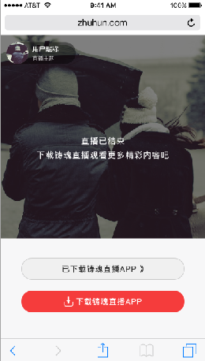
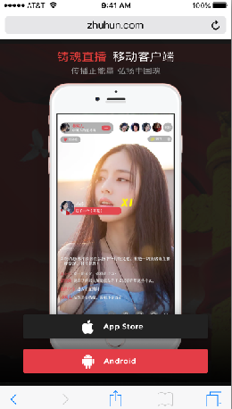

# 手机直播项目

展示一下几个设计界面：






### 下载和打开app
下载

下载应该比较简单，就是对应一个下载链接．只做了android的下载．由于app没有上线，所以没有应用商店的下载链接，Android直接打包放在服务器，Ios听说是不能打包所以没有添加下载链接．

这里有个经验：程序中有链接或是字符串之类的变量最好在项目添加一个全局的配置文件来存放．
就在上面截图都可以看到有很多下载按钮的借口，之前没有写在配置文件，每次android打包一次我就要到很多地方去修改地址．后来发现太麻烦，写在配置文件，每次只需要修改，配置文件一处地方就好了．

打开APP

先来一个[链接](https://segmentfault.com/a/1190000005967865?utm_source=tuicool&utm_medium=referral)
再来一个[链接](http://www.jb51.net/article/97668.htm)

网上有很多方法，我试过微信App的打开，是OK的

*而对于点击链接后，能否直接打开，可以通过下面的代码来实现。前提条件：你得知道你的APP对应的打开协议，如贴吧APP，协议为：`com.baidu.tieba://` ，微信的：`weixin://`*　对于这个打开协议，我android和ios的同事表示他们也不知道．这．．．我一个前端更不知道，由于项目最后都没有上线所以没有继续讨论下去．之后再去探讨．

```javascript

<!-- a标签的链接，设置为对应的下载链接；点击打开的动作，在click事件中注册 -->
<a href="https://itunes.apple.com/cn/app/id477927812" id="openApp">贴吧客户端</a>

<script type="text/javascript">
    document.getElementById('openApp').onclick = function(e){
        // 通过iframe的方式试图打开APP，如果能正常打开，会直接切换到APP，并自动阻止a标签的默认行为
        // 否则打开a标签的href链接
        var ifr = document.createElement('iframe');
        ifr.src = 'com.baidu.tieba://';
        ifr.style.display = 'none';
        document.body.appendChild(ifr);
        window.setTimeout(function(){
        document.body.removeChild(ifr);
    },3000)
};
</script>
```


### 聊天室

聊天室之后都没有做，实现不了．受到手机浏览器的限制，设计毕竟不知道技术嘛.给我也不知道呀以前也没做过．google浏览器　－　F12　－　手机模式这些没有问题嘛
可谁知道拿到手机上不得行了，这是分享出来，用户一般会直接打开链接，默认就在微信内置浏览器或者QQ浏览器中打开，这就坑了．

我之前了解聊天室是用webSocket来做，但没机会做过

这里Android和Ios端都是用的三方的leancloud做的，这也是新接触的一个东西

### 三方分享

分享和三方登陆都主要是三个，微薄，微信，QQ. 都有对应的开放平台．我这里没有涉及到分享，处理分享后的页面

这里就有一个问题，必须和其他两个端商量好，这个分享链接．

我是这样处理，我给他们页面链接 `http://ddzs.cxria.com/home/#/live/1` 这个链接可以打开我的直播页面．

第二步，要找到对应的直播和用户数据，所以要在链接后面加上参数，

```
http://ddzs.cxria.com/home/#/live/1?videoId=1&userId=2
```

第三步，在页面加载完成前,解析地址栏的参数，发送请求，获取数据;我使用的vue所以在`created`周期解析参数，并请求接口.

以下是我写的一个参数解析方法：
```js
/*
* 解析地址栏参数
*
* @method getQueryObj
*
* @param
*
* @return {Object} 返回query参数对象
*
* */
export function getQueryObj() {
    let href = window.location.href
    let query = href.substr(href.indexOf('?')+1)
    let arr = query.split('&')
    let queryObj = {}

    for (let i = 0; i < arr.length; i++) {
        let keyVal = arr[i].split('=')

        queryObj[keyVal[0]] = keyVal[1]
    }
    return queryObj
}
```


**我之前用过一个百度分享，很好用[直通车](http://share.baidu.com/)**

### 手机直播

手机上的直播是比较麻烦的，所以放到最后

注意：手机浏览器对视频是有很多的限制，避免跑流量等

1. 视频必须用户手动点击播放，不能直接播放
1. 在部分浏览器播放视频时会直接全屏，这样设计图的效果肯定实现不了了
1. 等等

直播是用的三方[七牛](https://www.qiniu.com/?hmsr=biaoti&hmpl=pinzhuan&hmcu=biaoti&hmkw=&hmci=)，[video.js插件](http://videojs.com/)报毒诶这个官网，有毒吧,继续访问吧

Android和Ios使用的是rtmp作为直播流，理所当然我也用这个协议了，毕竟后端就给了我一个rtmp流，找了很多解决方案，各种尝试也不得行．`rtmp`好像可以通过flash播放，在我的记忆中，苹果是不支持flash，而且手机上还要去装个flash,这就坑了．

后台再到七牛，获`m3u8`的流．web端可以播放了

说一下为什么用rtmp而没有用m3u8,是因为m3u8的延迟更高，这会对直播体验不好．但是手机web端播不了啊．

video.js的解决方案[videojs-contrib-hls](https://github.com/videojs/videojs-contrib-hls)

<font color=red>要注意</font>高版本是对立出去了，需要单独引入这个js文件,还有`videojs-contrib-hls.js`要在`video.js`之后引入

```html
<!DOCTYPE html>
<html lang="en">
<head>
    <meta name="viewport" content="user-scalable=yes, initial-scale=1.0, maximum-scale=1.0, minimum-scale=1.0">
    <meta charset="UTF-8">
    <meta name='apple-itunes-app' content='app-id=477927812'>
    <title>铸魂直播</title>
    <link href="https://unpkg.com/video.js/dist/video-js.css" rel="stylesheet">
    <script src="https://unpkg.com/video.js/dist/video.js"></script>
    <script src="https://unpkg.com/videojs-contrib-hls/dist/videojs-contrib-hls.js"></script>
</head>
<body>
    <div id="app">
        <app></app>
    </div>
</body>
</html>

```
[这是一个官方描述](http://docs.videojs.com/tutorial-troubleshooting.html)

[官方的列子](http://jsbin.com/vokipos/8/edit?html,output)


---

allen

2017.9.29 记

