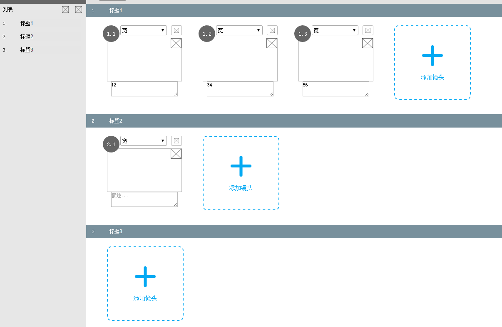

# 基于svg的关于剧本场景绘制的项目

## 项目介绍

### 技术栈

1. vue
2. scss
3. es6
4. svg.js
5. axios
6. jquery
7. webpack

### 展示

项目是关于剧本绘制，剧本章节的创建，场景绘制（直线，箭头，圆，矩形，文字，图片等基本操作），对绘制的对象进行操作（删除，旋转，放大缩小，文字编辑等）等。

展示一下，简单展示两个demo页面

1. 章节标题



2. 画布页面


### 收获

#### canvas VS svg

##### Canvas
* 依赖分辨率
* 不支持事件处理器
* 弱的文本渲染能力
* 能够以 .png 或 .jpg 格式保存结果图像
* 最适合图像密集型的游戏，其中的许多对象会被频繁重绘

##### SVG
* 不依赖分辨率
* 支持事件处理器
* 最适合带有大型渲染区域的应用程序（比如谷歌地图）
* 复杂度高会减慢渲染速度（任何过度使用 DOM 的应用都不快）
* 不适合游戏应用

> Canvas提供的功能更原始，适合像素处理，动态渲染和大数据量绘制
SVG功能更完善，适合静态图片展示，高保真文档查看和打印的应用场景

考虑到最后这写场景会被打印成图片等操作，最后决定使用svg

#### svg.js

[关于svg.js写在另外一篇](../chapter6/svg.html)

svg.js像jquery一样。对svg进行了封装。非常轻量，更主要是好用。
顺便一说还有个`snap.svg.js`,感觉也还不错

还用到svg.js等插件

* svg.draggable.js // 拖拽
* svg.resize.js // 缩放旋转
* svg.select.js // 选择

#### 实现svg基本图形绘制

```js
bindBarEvent () { // 画图形事件
                const that = this

                this.draw.on('mousedown', function (ev) {
                    that.startPos = {x: ev.offsetX, y: ev.offsetY}
                    switch (that.type) {
                        case 'ctrl':
                            break
                        case 'line':
                            that.shape = that.draw.line(that.startPos.x, that.startPos.y, that.startPos.x, that.startPos.y)

                            that.shape.stroke({color: that.strokeColor, width: 2, linecap: 'round'})
                            break
                        case 'arrow':
                            that.shape = that.draw.line(that.startPos.x, that.startPos.y, that.startPos.x, that.startPos.y)
                            that.shape.stroke({color: that.strokeColor, width: 2, linecap: 'round'})
                            that.shape.marker('end', 9, 6, function (add) {
                                add.path('M0,0 L0,6 L9,3 Z').fill(that.strokeColor)
                            })
                            break
                        case 'polyline':
                            that.shape = that.draw.line(that.startPos.x, that.startPos.y, that.startPos.x, that.startPos.y)

                            that.shape.stroke({color: that.strokeColor, width: 2, linecap: 'round'})
                            break
                        case 'circle':
                            that.shape = that.draw.circle(0).move(that.startPos.x, that.startPos.y)
                            that.shape.stroke({
                                color: that.strokeColor,
                                width: 2,
                                linecap: 'round'
                            }).fill(that.fillColor)
                            break
                        case 'rect':
                            that.shape = that.draw.rect(0, 0).move(that.startPos.x, that.startPos.y)
                            that.shape.stroke({
                                color: that.strokeColor,
                                width: 2,
                                linecap: 'round'
                            }).fill(that.fillColor)
                            break
                        case 'ellipse':
                            that.shape = that.draw.ellipse(0, 0).move(that.startPos.x, that.startPos.y)
                            that.shape.stroke({
                                color: that.strokeColor,
                                width: 2,
                                linecap: 'round'
                            }).fill(that.fillColor)
                            break
                        case 'text':
                            let text = prompt('输入文本')

                            if (text) {
                                that.shape = that.draw.text(text).move(that.startPos.x, that.startPos.y)
                                that.shape.dx(0).dy(-10).fill(that.strokeColor)

                                that.allShapeObj.push(that.shape)
                                that.saveHistoryHtml() // 保存历史
                                that.shape = null
                            }
                            break
                        default:

                    }
                })
                this.draw.on('mousemove', function (ev) {
                    if (that.shape === null) {
                        return
                    }
                    that.mousePos = {x: ev.offsetX, y: ev.offsetY}
                    switch (that.type) {
                        case 'ctrl':
                            break
                        case 'line':
                            that.shape.attr('x2', that.mousePos.x)
                            that.shape.attr('y2', that.mousePos.y)
                            break
                        case 'arrow':
                            that.shape.attr('x2', that.mousePos.x)
                            that.shape.attr('y2', that.mousePos.y)
                            break
                        case 'polyline':
                            that.shape.attr('x2', that.mousePos.x)
                            that.shape.attr('y2', that.mousePos.y)
                            break
                        case 'circle':
                            that.shape.attr('r', Math.sqrt(Math.pow(that.mousePos.x - that.startPos.x, 2) + Math.pow(that.mousePos.y - that.startPos.y, 2)))
                            break
                        case 'rect':
                            that.shape.attr('width', Math.abs(that.mousePos.x - that.startPos.x))
                            that.shape.attr('height', Math.abs(that.mousePos.y - that.startPos.y))
                            break
                        case 'ellipse':
                            that.shape.attr('rx', Math.abs(that.mousePos.x - that.startPos.x))
                            that.shape.attr('ry', Math.abs(that.mousePos.y - that.startPos.y))
                            break
                        case 'text':
                            break
                        case 'image':
                            if (that.shape === 'image') {
                                that.shape = that.draw.image(that.image)
                            }
                            that.shape.size(100, 100).move(that.mousePos.x, that.mousePos.y)
                            break
                        default:

                    }
                })
                this.draw.on('mouseup', function (ev) {
                    if (that.shape === null) {
                        return
                    }
                    that.endPos = {x: ev.offsetX, y: ev.offsetY}
                    switch (that.type) {
                        case 'ctrl':
                            break
                        case 'line':
                            that.shape.attr('x2', that.endPos.x)
                            that.shape.attr('y2', that.endPos.y)
                            that.allShapeObj.push(that.shape)
                            that.shape = null
                            that.saveHistoryHtml() // 保存历史
                            break
                        case 'arrow':
                            that.shape.attr('x2', that.endPos.x)
                            that.shape.attr('y2', that.endPos.y)
                            that.allShapeObj.push(that.shape)
                            that.shape = null
                            that.saveHistoryHtml() // 保存历史
                            break
                        case 'polyline':
                            break
                        case 'circle':
                            that.shape.attr('r', Math.sqrt(Math.pow(that.endPos.x - that.startPos.x, 2) + Math.pow(that.endPos.y - that.startPos.y, 2)))
                            that.allShapeObj.push(that.shape)
                            that.shape = null
                            break
                        case 'rect':
                            that.shape.attr('width', that.endPos.x - that.startPos.x)
                            that.shape.attr('height', that.endPos.y - that.startPos.y)
                            that.allShapeObj.push(that.shape)
                            that.shape = null
                            that.saveHistoryHtml() // 保存历史
                            break
                        case 'ellipse':
                            that.shape.attr('rx', Math.abs(that.endPos.x - that.startPos.x))
                            that.shape.attr('ry', Math.abs(that.endPos.y - that.startPos.y))
                            that.allShapeObj.push(that.shape)
                            that.shape = null
                            that.saveHistoryHtml() // 保存历史
                            break
                        case 'text':

                            break
                        case 'image':
                            that.shape = null
                            that.saveHistoryHtml() // 保存历史
                            break
                        default:
                    }
                })
            }
```