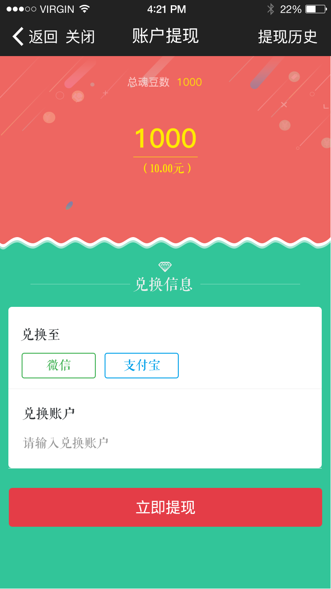

# weixin公众号项目

这个项目比较小的，总共也就6个页面吧．登陆页面，充值页面，充值记录，提现页面，提现记录，官网app下载页面

这个项目也是属于直播项目，后台我提前了Android和Ios一个月做完，所以我来做公众号，为什么要在公众号上来做提现和充值功能．直接在app上充值提现不就完了还这么麻烦到公众号．听说是app端出了什么新的限制不能在app端充值．好吧我对app也是不很了解．

效果图：

随便展示一下界面：

测试公众号效果

### 测试号
开发阶段可以申请一个测试公众号，在上面进行开发，等开发完成之后再移至正式服务号
测试号的申请很简单[文档](https://mp.weixin.qq.com/wiki?t=resource/res_main&id=mp1445241432)

### 微信开发工具

### 三方登陆

### 支付
