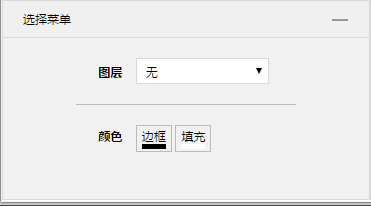
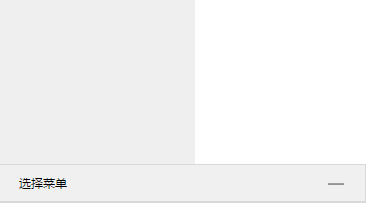

# 折叠板

[查看在线列子](https://caoshengxiang.github.io/comui/#/ui/collapse)

## 项目中效果截图

###　效果一

**１**

**2**

## 使用说明

1. props

名称|说明
---|---
title |标题

2. slot

名称|说明
---|---
title |标题栏
默认 |容器

具体实现在`collapse.vue`文件

两个slot,一个命名slot, title用于定制标题栏．

使用默认标题直接prop　传递title即可，事例是默认标题样式

不具名slot为折叠板内容部分

