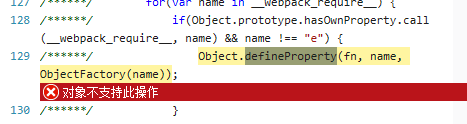

# vue.js

Vue是以数据为驱动的，Vue自身将DOM和数据进行绑定，一旦创建绑定，DOM和数据将保持同步，每当数据发生变化，DOM会跟着变化。

ViewModel是Vue的核心，它是Vue的一个实例。

>Vue.js特点
简洁：页面由HTML模板+Json数据+Vue实例组成
数据驱动：自动计算属性和追踪依赖的模板表达式
组件化：用可复用、解耦的组件来构造页面
轻量：代码量小，不依赖其他库
快速：精确有效批量DOM更新
模板友好：可通过npm，bower等多种方式安装，很容易融入

## vue 生命周期
create 创建前/后
mount 载入前/后
update 更新前/后
destroy 销毁前/后

## watch
深度监听

## 数据双向绑定的原理
vue.js 是采用数据劫持结合发布者-订阅者模式的方式，通过Object.defineProperty()来劫持各个属性的setter，getter，在数据变动时发布消息给订阅者，触发相应的监听回调。

## 数据通讯
* prop
* 自定义事件
* 使用一个空的 Vue 实例作为事件总线
```js
var bus = new Vue()
// 触发组件 A 中的事件
bus.$emit('id-selected', 1)
// 在组件 B 创建的钩子中监听事件
bus.$on('id-selected', function (id) {
  // ...
})
```
* vuex

state,getter,mutation,action,module

map辅助函数

### mutation
最好提前在你的 store 中初始化好所有所需属性。

当需要在对象上添加新属性时，你应该

使用 Vue.set(obj, 'newProp', 123), 或者

以新对象替换老对象

### action
Action 提交的是 mutation，而不是直接变更状态。
Action 可以包含任意异步操作。

>乍一眼看上去感觉多此一举，我们直接分发 mutation 岂不更方便？实际上并非如此，还记得 mutation 必须同步执行这个限制么？Action 就不受约束！我们可以在 action 内部执行异步操作\[官网原话，这里值得注意]

## mvvm
HTML模板（View）+Json数据（Model）+Vue实例（ViewModel）

## vue 响应式原理？？还需要更深入了解
[这里很详细](http://www.imooc.com/article/14466)

实现数据绑定的做法有大致如下几种：
发布者-订阅者模式（backbone.js）
脏值检查（angular.js）
数据劫持（vue.js）

## vue-router的使用及实现原理
前端路由是直接找到与地址匹配的一个组件或对象并将其渲染出来.
对地址变更的监听通过监听 hashChange 事件来实现
```
window.addEventListener('hashchange', () => {
  // this.transitionTo(...)
})
```


改变浏览器地址而不向服务器发出请求有两种方式:
1. 在地址中加入#以欺骗浏览器，地址的改变是由于正在进行页内导航
2. 使用H5的window.history功能，使用URL的Hash来模拟一个完整的URL。

区别：
>通过history api，丢掉#，但是它也有个问题：
 可以前进，后退，但刷新，f5会出问题，（如果后端没有准备的话）,因为刷新是实实在在地去请求服务器的。
 在hash模式下，前端路由修改的是#中的信息，而浏览器请求时是不带它玩的，所以没有问题.但是在history下，你可以自由的修改path，当刷新时，如果服务器中没有相应的响应或者资源，会出现404。


## 指令

## vue拖拽 drag and drop
[这里有个例子](https://codepen.io/Lazyboy/pen/RRgRPb)

我写了一段测试代码：
```html
<a draggable='true'  @dragstart='drag($event)'>qwerwe</a>
<div id="" style="width: 300px; height: 300px;border: 1px solid red;"   @drop='drop($event)'
    @dragEnter="dragenter('enter')"
    @dragleave="dragleave('leave')"
    @dragend="dragEnd('end')"
    @dragover='allowDrop($event)'>
</div>
```
发现只有`dragstart`， `dragleave`， `dragover`方法起作用。
`draggable='true'`html5的元素可拖动

## 阻止默认事件
```html
<!-- 阻止单击事件冒泡 -->
<a v-on:click.stop="doThis"></a>

<!-- 提交事件不再重载页面 -->
<form v-on:submit.prevent="onSubmit"></form>

<!-- 修饰符可以串联 -->
<a v-on:click.stop.prevent="doThat">

<!-- 只有修饰符 -->
<form v-on:submit.prevent></form>
```

## 虚拟DOM
这就是所谓的 Virtual DOM 算法：

用 JavaScript 对象结构表示 DOM 树的结构；然后用这个树构建一个真正的 DOM 树，插到文

档当中当状态变更时，重新构造一棵新的对象树。然后用新的树和旧的树进行比较两个数的差异。

然后把差异更新到久的树上，整个视图就更新了。Virtual DOM 本质就是在 JS 和 DOM 之间做

了一个缓存。既然已经知道 DOM 慢，就在 JS 和 DOM 之间加个缓存。JS 先操作 Virtual DOM

对比排序/变更，最后再把整个变更写入真实 DOM。

https://www.cnblogs.com/wubaiqing/p/6726429.html

[vue2中diff算法]http://www.jianshu.com/p/22f82cc60285


react.js书法本质是重绘视图，相当于设置innerHTML，利用diff，更新最小DOM


## 解析vue不支持IE8

vue在ie8下运行的报错：



可以看到不支持ES5的defineProperty，前面有讲这个是vue在数据劫持使用的方法。