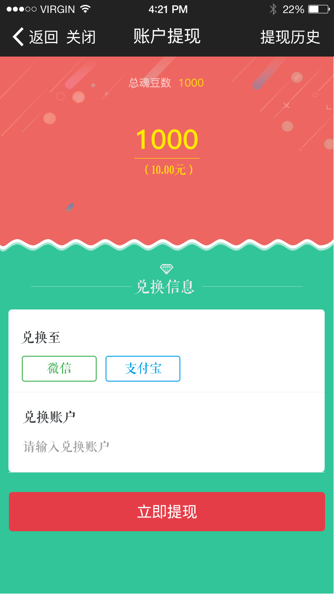
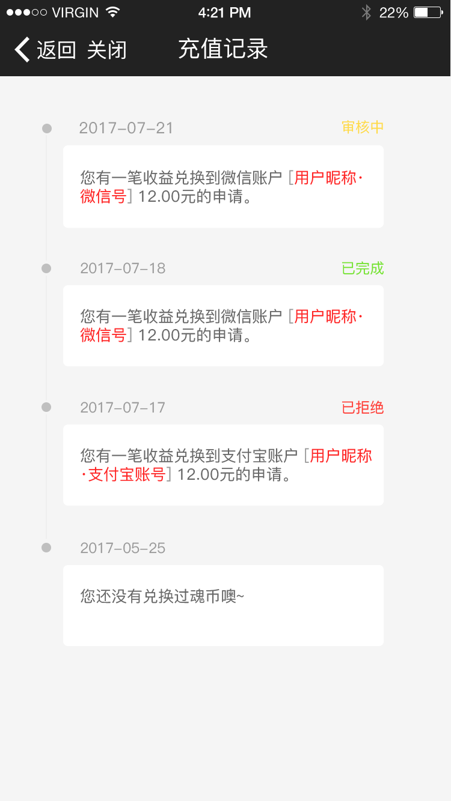
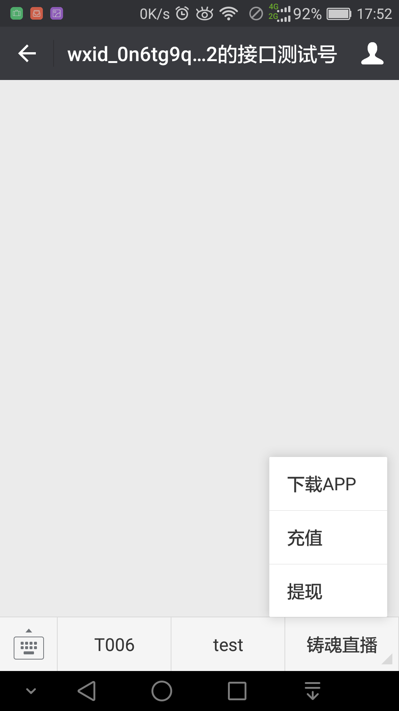
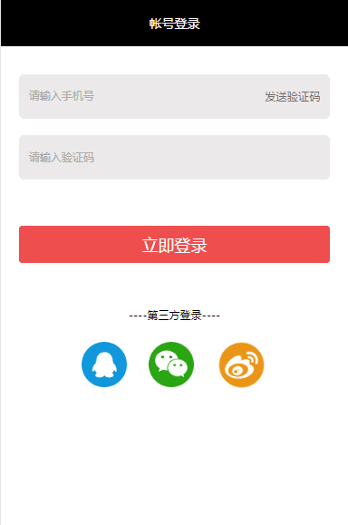

# weixin公众号项目

这个项目比较小的，总共也就6个页面吧．登陆页面，充值页面，充值记录，提现页面，提现记录，官网app下载页面

这个项目也是属于直播项目，后台我提前了Android和Ios一个月做完，所以我来做公众号，为什么要在公众号上来做提现和充值功能．直接在app上充值提现不就完了还这么麻烦到公众号．听说是app端出了什么新的限制不能在app端充值．好吧我对app也是不很了解．

效果图：

随便展示一下界面：

<!--  -->
<!--  -->


测试公众号效果

<!--  -->


### 测试号
开发阶段可以申请一个测试公众号，在上面进行开发，等开发完成之后再移至正式服务号
测试号的申请很简单[文档](https://mp.weixin.qq.com/wiki?t=resource/res_main&id=mp1445241432)
<font color=#008080>不要妄想微信文档可以通过链接定位到目标文档，好坑的文档</font>

［开始开发］－［接口测试号申请］－ 就可以通过你的微信申请测试号

有appID和appsecret这些信息，配置好服务器URL等就可以开发了，

［开始开发］－［接口在线调试］ - 调试借口会用到测试号的appID和secret

首先你的调用接口获取access_token，才能调用其他借口，配置菜单，路径之内的

然后扫码关注就可以在微信公众号看到了．

注意：安全域名一定要正确，网页授权域名

#### 获取openid

1. 配置公共号按钮
```json
{
  "button":[
    {
      "type":"click",
      "name":"T006",
      "key":"V1001_TODAY_MUSIC"
    },{
      "type": "click",
      "name": "test",
      "key": "0001"
    },
    {
      "name":"铸魂直播",
      "sub_button":[
        {
          "type":"view",
          "name":"下载APP",
          "url":"http://mobile.daodezhisheng.cn/home"
        },{
          "type":"view",
          "name":"充值",
          "url": "https://open.weixin.qq.com/connect/oauth2/authorize?appid=wx5361584af99506d9&redirect_uri=http%3A%2F%2Fmobile.daodezhisheng.cn%2Fweixin%2F%23%2Frecharge&response_type=code&scope=snsapi_base&state=1#wechat_redirect"
        },{
          "type":"view",
          "name":"提现",
          "url": "https://open.weixin.qq.com/connect/oauth2/authorize?appid=wx5361584af99506d9&redirect_uri=http%3A%2F%2Fmobile.daodezhisheng.cn%2Fweixin%2F%23%2Fwithdraw&response_type=code&scope=snsapi_base&state=1#wechat_redirect"
        }
      ]
    }]
}
```
[官方教程](https://open.weixin.qq.com/cgi-bin/showdocument?action=dir_list&t=resource/res_list&verify=1&id=open1419316505&token=&lang=zh_CN)
url是配置的借口在redirect_uri回调到我的服务器地址．这时我的回调地址中会返回我一个code，然后解析code,在调用微信借口获取openid，但是这里我获取失败了<font color=red>我记得在文档有个地方用红色字体说明，不能将这些openid这些用户信息存在前端，只能在后台．</font>可能是这个原因我无法请求到．所以只有辛苦一下后端的同事帮我获取．

### 微信开发工具
之前就听说这个工具不好用，所都没用．最后做支付的时候，遇到坑，不得不用

<font color=red>注意：</font>微信开发工具是不能支付的．可是他都没有提示，尽给我挖坑！百度还好有前辈

### 三方登陆

效果：



最常见的三个，QQ,weiChat,weibo

对比了一下android和ios两个端的在开放平台的申请，web端的申请最复杂．
这里有个经验：这些三方的审核最好是提前去做．我在这里就跳了一个坑．还是由于没有前车之鉴，没有接触过，三方登陆是放在在后来做的，所以一直没去了解登陆流程．在做到这一块时才去弄这块的审核．web提交的材料好复杂，记得来有个什么备案信息，公司的三证的信息．审核中也被据好了几次．每次提交后又要等几天．特别影响开发进度．

如果是有别人做三方的审核一定要提醒他早做，反正一定要准备在前面

最后三方登陆是后端做的．请求后端借口，后端重定向到三方登陆页面，成功后回调到登陆时的前端页面．

最后决定又后端这么做是有原因的，微信的登陆始终不成功．我个人觉得前端是可以实现登陆，不能登陆和审核没有通过有很大关系．下次开发时再好好研究．微信就是坑．．．，反正又不是我一个人在吐嘈

发现现在比较流行的一种登陆方式，直接使用手机号＋验证码,进行登陆．
对于三方登陆，就是降低注册门槛，设计基于这个准则就好

### 支付

支付这里被坑的不要不要的，支付宝很好调用．微信我也无力吐嘈．
用了一个三方支付Ping++
**传说七行代码接入支付**

开发用的时候是测试环境，支付宝会跳转到一个模拟支付的页面，看下图：
图片找不到了，是调起的一个支付宝的支付界面，提示显示该页面代表测试支付成功

然后是微信支付，测试截图如下：


点击确认之后就没有了反应，也没看到错误信息，这就蒙了．毕竟第一次做支付．也不知道正确的情况会是怎么样，人生总是要走很多弯路，以为这样是就好了．毕竟还有其他事要做．就先放一放．等接到正式环境才发下，微信支付不了．也看不到错哦，微信的开发工具又不能测支付！！！．

偶然我用一个同事的手机打开，弹出了一个框提示url为注册．有一点线索了
百度，网上都说是微信的支付授权目录填写不对，那就该这就很麻烦了，这个公众号又有不在我这里，这是一个外包项目，客服的公众号是在运营的．我登陆每次要叫人家扫码，毕竟网上讲的这么多你的各种试啊！这是一个伤心的往事．．．
这里随便找的一个简书教程讲的比较清楚[微信支付：“当前页面的URL未注册”](http://www.jianshu.com/p/6f633c5d6d10)

怎么改还是不能支付，问题应该就不在这里了，但是这个问题的确值得注意，所以把教程链接放上去．
> 1. 区分大小写
  2. 支付目录正确书写

这里就是注意<font color=red>当前页面的URL未注册</font>

继续找问题，偶然看到一篇文章将可能因为ping++支付相关的配置有错，可能引起这个原因，

于是让他们核对ping++配置．因为有android和ios的配置,还有公众号的，太久记不清了这些配置数据了．就重新配置．配置完还是不能支付．

接下来细心的同时，去检查微信支付的配置．果然找到了问题，好象是[微信商户平台](https://pay.weixin.qq.com/index.php/core/home/login?return_url=%2F)把app端的支付配到了公众号，我好蒙！有点崩溃．这些帐号都是客户公司，微信登陆每次要扫嘛，商户平台还要，注册人手机验证码．好复杂．我之前也没接触过啊！这些配置也不是我配的．完全想不到原因．通过这次项目我至少大概知道这些三方支付流程，和可能那些地方出现问题，帮助我下次卡法．

看着微信的文档，心里想得就是再也不想做微信公众号了，再也不做微信支付了．但是微信支付肯定是逃脱不了的，毕竟微信支付，支付宝支付都这么火．之前在网上就看到有写人说：微信文档简单，但是第一次看会有困难．这回我信．

更多经验还得在下次项目中运用后总结

[微信公众平台](https://mp.weixin.qq.com/wiki?t=resource/res_main&id=mp1445241432)

[微信开放平台](https://open.weixin.qq.com/cgi-bin/showdocument?action=dir_list&t=resource/res_list&verify=1&lang=zh_CN)

[微信商户平台](https://pay.weixin.qq.com/index.php/core/home/login?return_url=%2F)


补充漏掉的:

微信浏览器还有多的限制
-----------

allen

2017.9.29 记